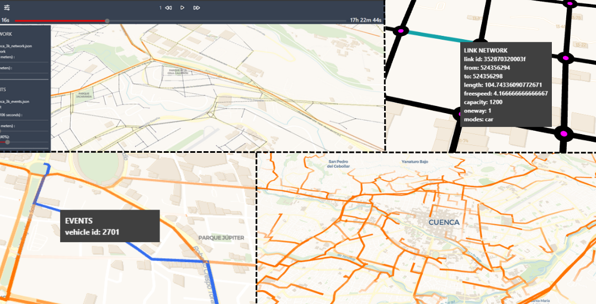

# TrafficSim-Vis

Christopher Almachi, Rolando Armas and Erick Cuenca

This is a single-page application developed to view files processed from MATSim simulations. It emerged as part of the work "Visual Analytics of Traffic Simulation Data". Users can view and analyze traffic simulation data using browsers efficiently.

Resume

In today's world, transportation is one of society's most important needs, especially in urban areas. Traffic management and planning are essential to ensure a continuous flow of traffic and minimize congestion. Furthermore, information visualization plays a crucial role in the visual analysis of data that mainly comes from raw and abstract data. Simulations provide detailed information on traffic flow, positions, congestion, etc. However, the effectiveness of simulators is limited by the capacity of computers since when faced with large data sets, their ability to support large-scale microscopic simulations decreases significantly. In this work, we have developed a visual analytics single-page application called TrafficSim-Vis consisting of preprocessing and visualization. The first part is a set of steps to convert the Multi-Agent Transportation Simulation (MATSim) output data into a format compatible with web frameworks. The second part focuses on a single-page application in which preprocessed data will be entered for display. To do this, the application uses advanced frameworks, such as Deck GL, capable of handling large amounts of data. The development is verified, and the visualization tool is finally tested with simulated traffic data in Cuenca (Ecuador) and Santiago (Chile). As a result, we obtain an interactive interface that allows an attractive representation of the agents. In addition, users can analyze, interact, and explore different aspects of the data and obtain relevant information about the simulation.

## Links

[TrafficSim-Vis Single-Page](https://chrisaloor.github.io/TrafficSim-Vis/)| [Usage video](https://www.youtube.com/watch?v=orLhSy2Q9sM) | Also can read [Visual Analytics of Traffic Simulation Data: a Review](https://link.springer.com/chapter/10.1007/978-3-031-52517-9_4)

## Requirements 
This single-application uses npm, and was developed using VS Code
 - Install  Node js (18.0v >) with Node Package Manager npm (9.0v >)
 - Python (3.10v >)
    - install matsim-tools
    - install pandas
    - install pyproj

## Preprocess Files
To perform the visualization in TrafficSim-Vis, you must parse the output files generated by MATSim (output_network.xml.gz and output_events.xml.gz), from the repository, you must enter to [parsingFiles](https://github.com/ChrisALoor/TrafficSim-Vis/tree/main/parsing%20files) and take `parsingFiles_script.py`.

Now, to execute the file, you enter the name of the script, and the coordinates of the simulation that you want to parsing (for example, epsg:32717), after that, the path of the network and events files, respectively. (In case you want examples files to use parsing go to [exampleMATSimData](https://github.com/ChrisALoor/TrafficSim-Vis/tree/main/parsingFile/exampleMATSimData))

    python parsingFiles_script.py epsg:32717 <output_network.xml.g> <output_events.xml.gz> 

As a result we will obtain two files ready to upload to TrafficSim-Vis. On the other hand, if you want to modify or continue working on developing the code you need the following.

## Development Commands
You just need to make a copy of the repository and run: 

    npm install

this command installed all development dependencies 
    
After that, run:

    npm run dev

this command runs a local server usually listens on localhost

# Compiles and minifies for production

    npm run build